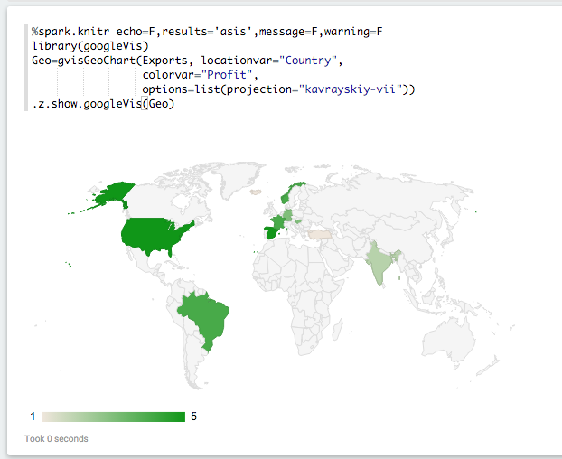
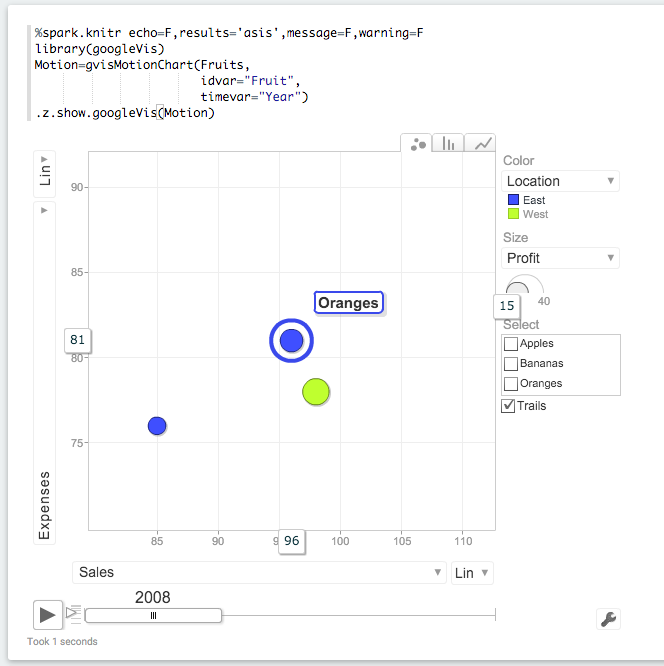

# rZeppelin:  Zeppelin With An R Interpreter 

This is a the Apache (incubating) Zeppelin project, with the addition of support for the R programming language and R-spark integration.

This has been accepted as a pull request to the Zeppelin project, and will be integrated once Zeppelin's automated testing system is updated to support it. 

## Why is This a Big Deal for Data Scientists?

Because it allows you to combine R, scala, and Python in a single, seamless, data/machine-learning pipeline, on-the-fly, on ad-hoc clusters, from a simple, integrated, interface. 

Simply put, it can put the power of a Spark cluster into the hands of regular R-using data scientists for their day-to-day work tasks with only a few hours' learning curve.

An ad-hoc cloud cluster can be created in minutes and run for only a few dollars, with no maintenance and no need for assistance from administrators or architects. 

## How Does it Do That?

Zeppelin is a web-based notebook built on top of Spark, kind of like Jupyter.  

Zeppelin has Spark-scala, SQL, and Pyspark interpreters that all share the same Spark context. 

The R Interpreter adds R to the list, again sharing the same Spark context.  

- _Use Case 1_: Given a large amount of text date, you could parse the files from whichever language you choose, then encode it (on the cluster) using Python and `word2vec`, then cluster the embeddings using a scala-based Spark package, and examine the results in R for visualization and to evaluate the clustering quality.  
 
- _Use Case 2_: Let's say that you're working in R on a large text-mining project. You've built your `DocumentTermMatrix` when you realize that training an `LDA` model is going to take a week. In a few minutes you can spin-up a Spark cluster on EC2, write your DTM to the cluster, and train the `LDA` model using Spark's MLlib in an hour instead of a week. Then bring the result right back into R. All for less than the cost of a trip to Starbucks. 

With this package, you can do all of that without switching interfaces, without changing languages, and without having to write intermediate results to disc. 

You can also take full advantage of Spark's lazy execution. 

Together, these capabilities mean that a Spark cluster can be part of an ordinary data scientist's day-to-day toolbox.  

## Zeppelin Documentation 

**Documentation:** [User Guide](http://zeppelin.incubator.apache.org/docs/index.html)<br/>

To know more about Zeppelin, visit [http://zeppelin.incubator.apache.org](http://zeppelin.incubator.apache.org)
 
## Installation & Getting Started

For general instructions on installing Zeppelin, see [https://github.com/apache/incubator-zeppelin](https://github.com/apache/incubator-zeppelin).

Additional requirements for the R interpreter are:

 * R 3.1 or later (earlier versions may work, but have not been tested)
 * The `evaluate` R package. 
 
For full R support, you will also need the following R packages:
 
 * `knitr` 
 * `repr` -- available with `devtools::install_github("IRkernel/repr")`
 * `htmltools` -- required for some interactive plotting
 * `base64enc` -- required to view R base plots

To install this build of Zeppelin with the R interpreter, after installing dependencies, execute:

```sh
git clone https://github.com/elbamos/Zeppelin-With-R.git
cd Zeppelin-With-R
mvn package install -DskipTests
```

To run Zeppelin with the R Interpreter, zeppelin must be started with the SPARK_HOME environment variable properly set. The best way to do this is by editing `conf/zeppelin-env.sh`. 

You should also copy `conf/zeppelin-site.xml.template` to `conf/zeppelin-site.xml`.  That will ensure that Zeppelin sees the R Interpreter the first time it starts up. 

To start Zeppelin, from the Zeppelin installation folder:

```sh
bin/zeppelin.sh # to start zeppelin or
bin/zeppelin-daemon.sh # to start zeppelin as a daemon
```

## Using the R Interpreter

By default, the R Interpreter appears as two Zeppelin Interpreters, `%spark.r` and `%spark.knitr`. 

`%spark.r` will behave like an ordinary REPL.  You can execute commands as in the CLI.   

[](screenshots/repl2plus2.png)

R base plotting is fully supported

[](screenshots/replhist.png)

If you return a data.frame, Zeppelin will attempt to display it using Zeppelin's built-in visualizations. 

[](screenshots/replhead.png)

`%spark.knitr` interfaces directly against `knitr`, with chunk options on the first line:

[](screenshots/knitgeo.png)
[](screenshots/knitstock.png)
[](screenshots/knitmotion.png)

The two interpreters share the same environment.  If you define a variable from `%spark.r`, it will be within-scope if you then make a call using `%spark.knitr`.

## Using SparkR & Moving Between Languages

If `SPARK_HOME` is set, the `SparkR` package will be loaded automatically:

[](screenshots/sparkrfaithful.png)
 
The Spark Context and SQL Context are created and injected into the local environment automatically as `sc` and `sql`.

The same context are shared with the `%spark`, `%sql` and `%pspark` interpreters:

[](screenshots/backtoscala.png)

You can also make an ordinary R variable accessible in scala and Python:

[](screenshots/varr1.png)

And vice versa:

[](screenshots/varscala.png)
[](screenshots/varr2.png)

## Running the Demo Notebook

There is an RInterpreter notebook included.  This is intended for for two groups of people:

* Members of the Zeppelin community who are reviewing the pull request for inclusion, to show them how the R interpreter works. 
* Members of the R community who are not familiar with Zeppelin and may be interested in the R interpreter and Zeppelin for their projects. 

To run the notebook properly the following additional packages should be installed:

 * `devtools`
 * `googleVis`
 * `rCharts`
 
The notebook is not intended to be part of the submission. 

**Caveats**:

* The `knitr` environment is persistent. If you run a chunk from Zeppelin that changes a variable, then run the same chunk again, the variable has already been changed.  Use immutable variables. 

* Using the `%spark.r` interpreter, if you return a data.frame, HTML, or an image, it will dominate the result. So if you execute three commands, and one is `hist()`, all you will see is the histogram, not the results of the other commands. This is a Zeppelin limitation.

* If you return a data.frame (for instance, from calling `head()`) from the `%spark.r` interpreter, it will be parsed by Zeppelin's built-in data visualization system.  

*	`htmlwidgets` does not work.  Neither does `shiny` or `ggvis.` 

## FAQs & Troubleshooting

### Why `knitr` Instead of `rmarkdown`?  Why no `htmlwidgets`?

A major difference between `knitr` and `rmarkdown` is that `rmarkdown` uses `pandoc`, an application external to R.

`htmlwidgets` produces HTML that references dependencies, javacript and css files, that in turn reference other dependencies. 

In `rmarkdown`, `pandoc` processes these dependencies, pulling-in and incorporating the referenced code into a single, self-contained HTML file. 

To use `pandoc`, though, `rmarkdown` writes everything to disc, then calls `pandoc` as an external process, then reads `pandoc`'s output back from disc.  

`knitr`, on the other hand, can operate entirely (or almost entirely) in RAM. 

Its the difference between getting a result in a second, and getting a result in a minimum of a minute.  

After testing, I felt the additional delay would be intolerable for most users and therefore chose to use `knitr` instead of `rmarkdown`.

I would like to support `htmlwidgets` and have done some work on code to handle dependencies, but it is a non-trivial task.

If there is really substantial interest, it isn't *too* challenging to add a `%spark.rmarkdown` interpreter to the mix.

### Why no `ggvis` or `shiny`?

Supporting `shiny` would require integrating a reverse-proxy into Zeppelin, which is a task. 

### But I really want to use `ggvis` and `shiny`!!!!

Then help me write the necessary code. This is open source, people.  

### I'm having installation problems with Mac OS X

Are you trying to install on a filesystem that is case-insensitive?  

This is the default for Mac OS X, and almost all Mac root partitions are case insensitive. Apparently this is because Adobe refuses to update Photoshop to run on a case sensitive filesystem.

Whatever.

Anyway, the R Interpreter source lives inside of sub-folder `r/`, but when it compiles, it outputs a compiled R package to sub-folder `R`. 

If your filesystem is case-insensitive, then when you run `mvn clean`, you may end-up inadvertently deleting the `r/` source directory. 

The solution is to install on a case-sensitive file system, don't run `mvn clean` or, if you do, be prepared to re-clone or re-fetch the source. 

### "When I try to use the REPL interpreter, I get an error `unable to start device X11` but I'm not even using X11"

Check your shell login scripts, usually `.bashrc` and `.bash_profile`.  If you see something like this:

```sh
dispdir=`dirname $DISPLAY`
dispfile=`basename $DISPLAY`
dispnew="$dispdir/:0"
if [ -e $DISPLAY -a "$dispfile" = "org.x:0" ]; then
  mv $DISPLAY $dispnew
fi
export DISPLAY=$dispnew
```

delete it or comment it out.  Shell scripting like this is a workaround for using X Windows over ssh on operating systems (certain versions of Mac OS X) that don't set the `DISPLAY` environment variable properly.  However, it interferes with a workaround for the same issue built into R. 

### "I'm Getting Weird Errors About the akka Library Version or `TTransport` Errors"

You are trying to run Zeppelin with a SPARK_HOME that has a version of Spark other than the one specified with `-Pspark-1.x` when Zeppelin was compiled.

This is an issue with the core Zeppelin build, and not one I can fix.  The only option is to recompile. 

### The R Interpreter Does Make a Spark Context and it Says It Can't Find SparkR, but Everything Else Works

You don't have `SPARK_HOME` set properly, or you have the `spark.home` Zeppelin configuration variable set. 

Because the version of `SparkR` has to match the version of Spark, the R Interpreter only looks for `SparkR` under `SPARK_HOME`. 

If it can't find `SparkR` there, unless there is a `SparkR` in the R library path, the R Interpreter will not be able to connect to the Spark Context. 

### But Everything Else Works So Its All Your Fault!

Like I said, the Zeppelin-Spark interface has changed in major ways repeatedly, and this has repeatedly broken the R Interpreter. 

I no longer attempt to support all of the Spark configuration options supported by Zeppelin for this reason. 

I support only one, which is running with `SPARK_HOME` set, and `spark.home` unset. 

### Will This Fork Track Zeppelin-Master?

It has already diverged.  

For one thing, a different method for supporting Spark 1.6 is used.  In addition, the less-often-used interpreters are not enabled by default.  

### What about Windows?

Zeppelin does not support Windows, therefore the R Interpreter does not support Windows.  Some people have gotten it to work using docker.  